# Techstore
Spring MVC application that focuses on e-commerce operations with computers and electronics.

# Description
Techstore is an online store for computers and electronics.<br>
It is developed for customers who are mainly looking for computers, accessories and different kinds of electronics.<br>
The web project is responsive having decent UI and UX.

# Code
The web application follows the best practices for Object-Oriented design and high quality code:

* abstraction, encapsulation, inheritance, polymorphism
* exception handling
* loose coupling and high cohesion
* thin controllers

# Built With

* Spring MVC
* Spring Security
* Spring Data JPA
* Spring Validation
* Spring Mail
* Spring Actuator
* Hibernate ORM
* MySQL Server
* ModelMapper
* Cloudinary
* JUnit
* Thymeleaf
* jQuery
* Bootstrap
* Font Awesome Icons

# Functionality

* User Login and registration
* User Profile
* Administrator management of users
* Administrator management of roles
* Adding product to cart
* Updating quantity of product in cart
* Removing product from cart
* Product CRUD operations
* Category CRUD operations
* Model CRUD operations
* Manufacturer CRUD operations

# Project Architecture
I am using MVC architecture consisting of several layers:

* View
* Controller
* Service
* Repository
* Database

# Quick Start & Implementation

* Administrator - seeded during first application initialization
```
Email: admin@techx7.com
Username: admin
Password: admin12345
```

* Roles - seeded during start of the application
```
Admin # Manager # Support # User # Carrier
```

# Database Diagram
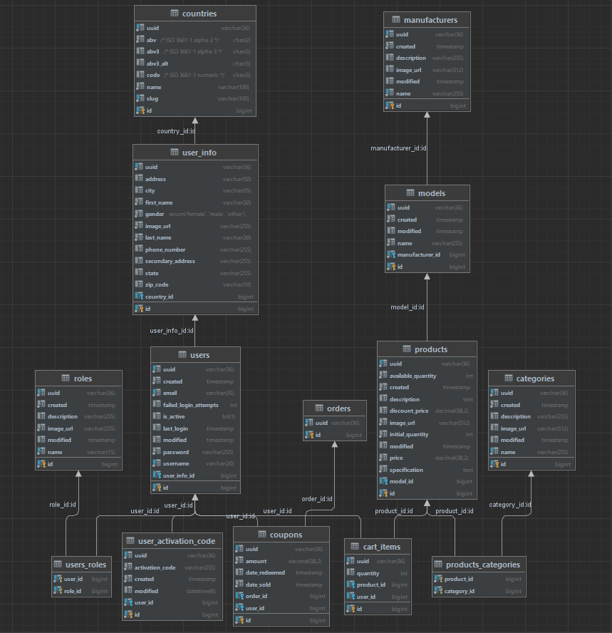

# Test

## Testing dependencies:
* JUnit
* Mockito

---

* Test coverage
* 

# Application pages

* Home


* Products

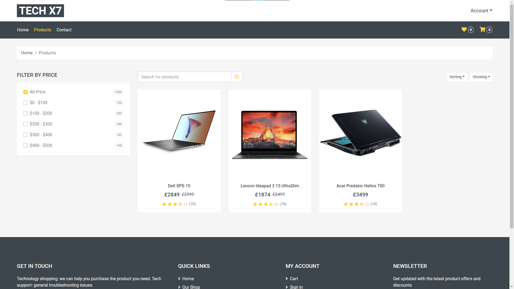

* Product Details

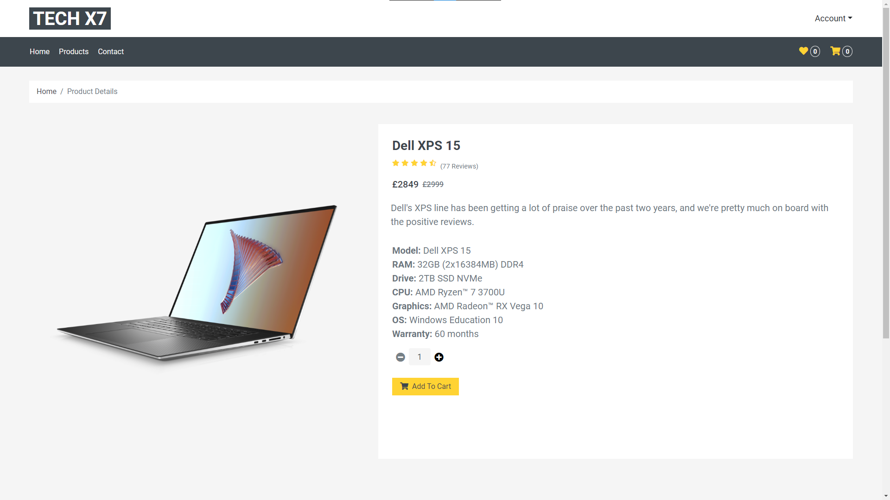

* Contact

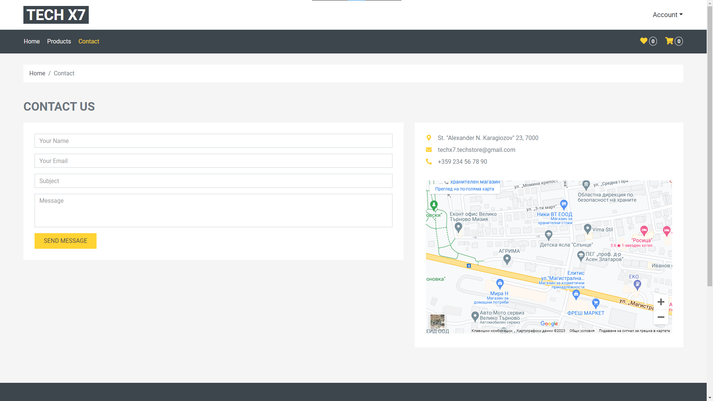

* Profile

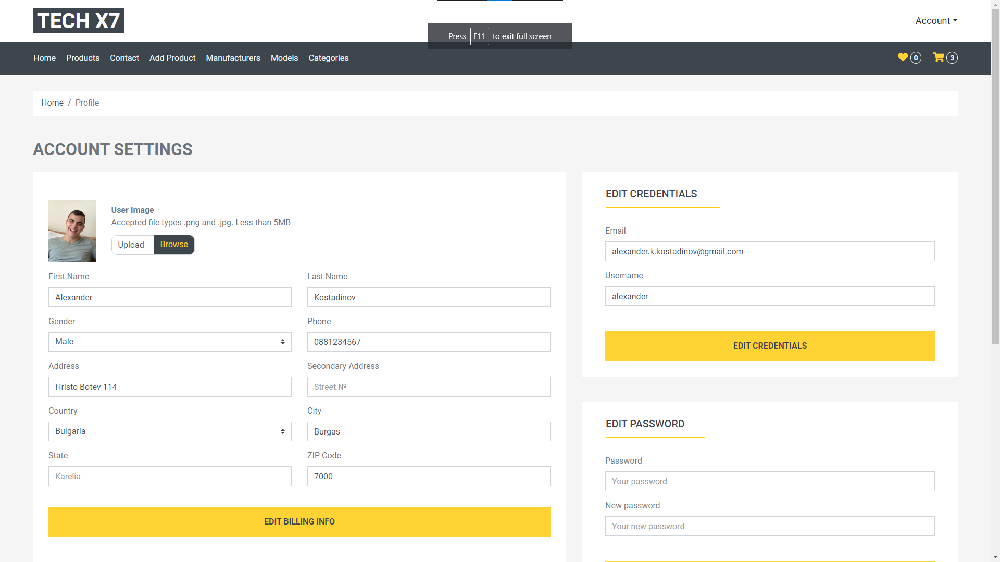

* Cart

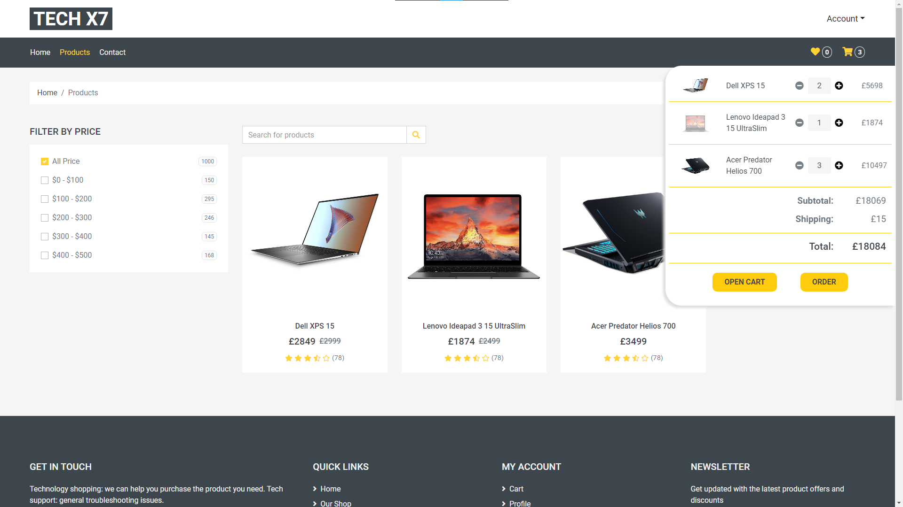

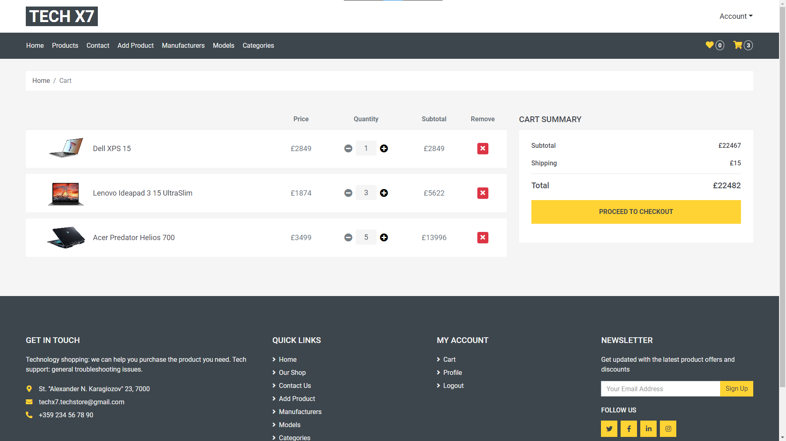

* Add Product

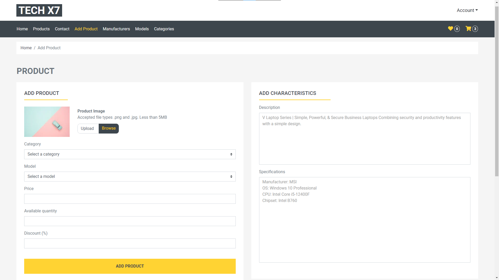

* Manufacturers

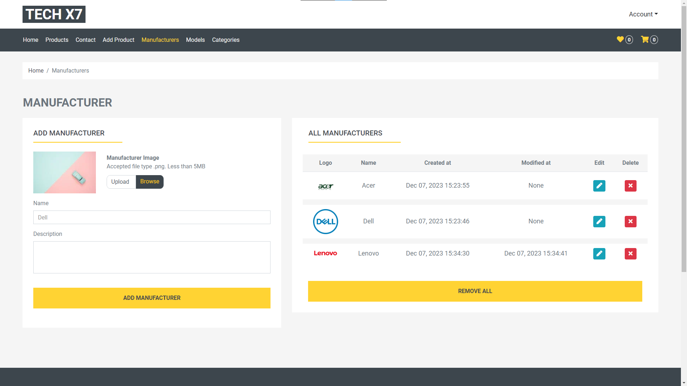

* Models

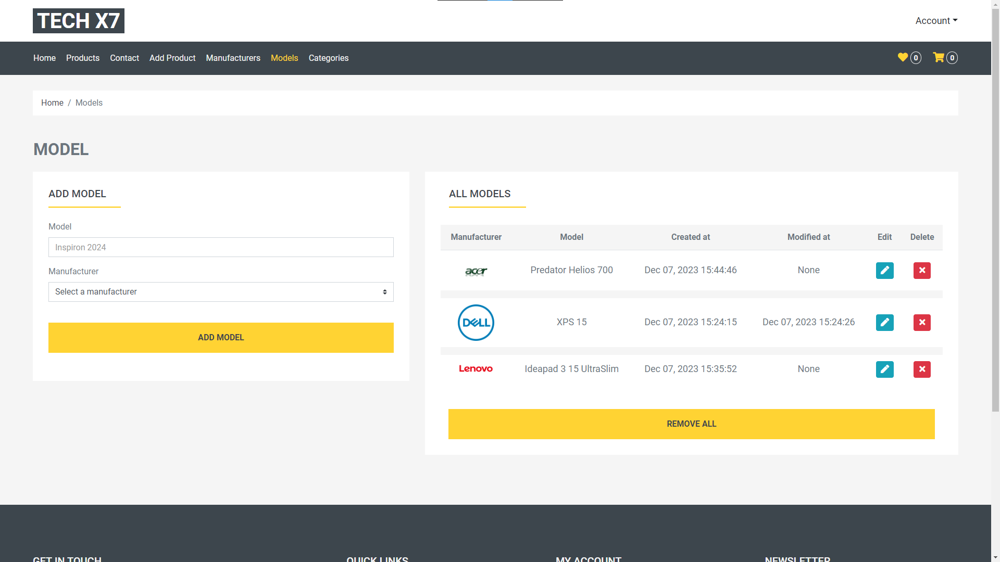

* Categories

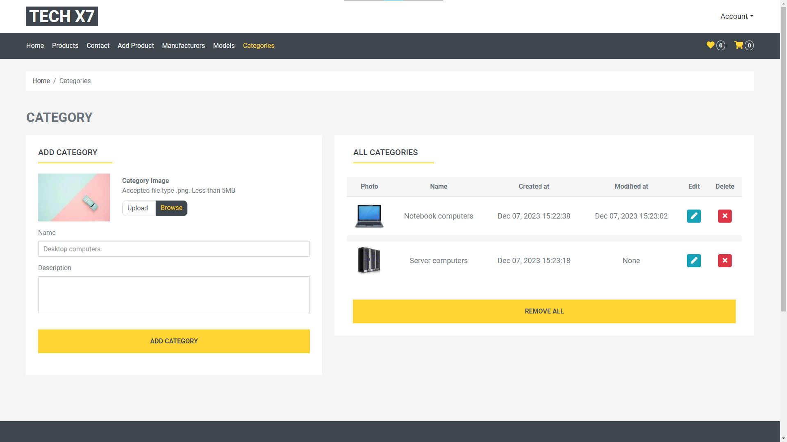

* Admin Management - Users

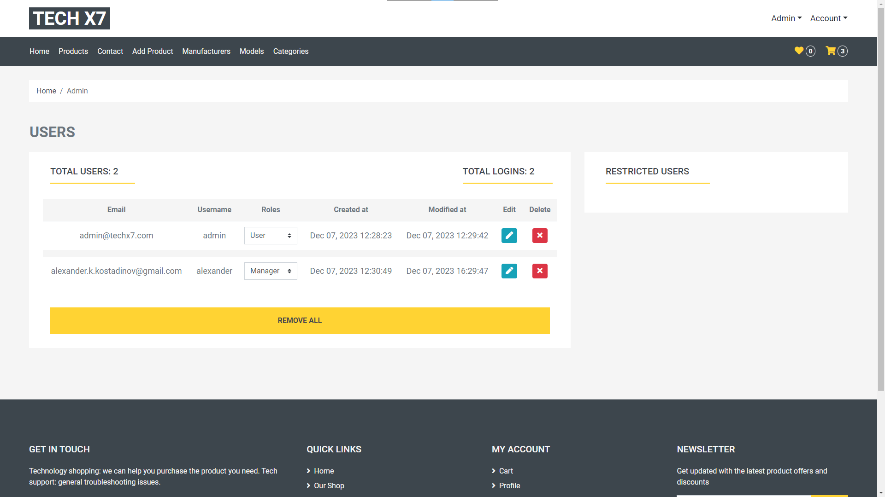

* Admin Management - Roles

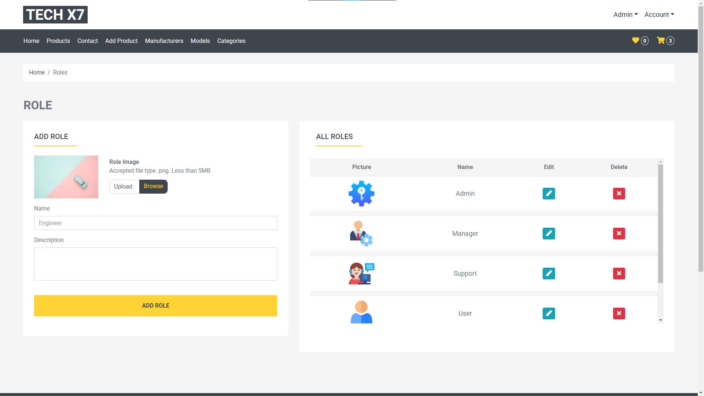